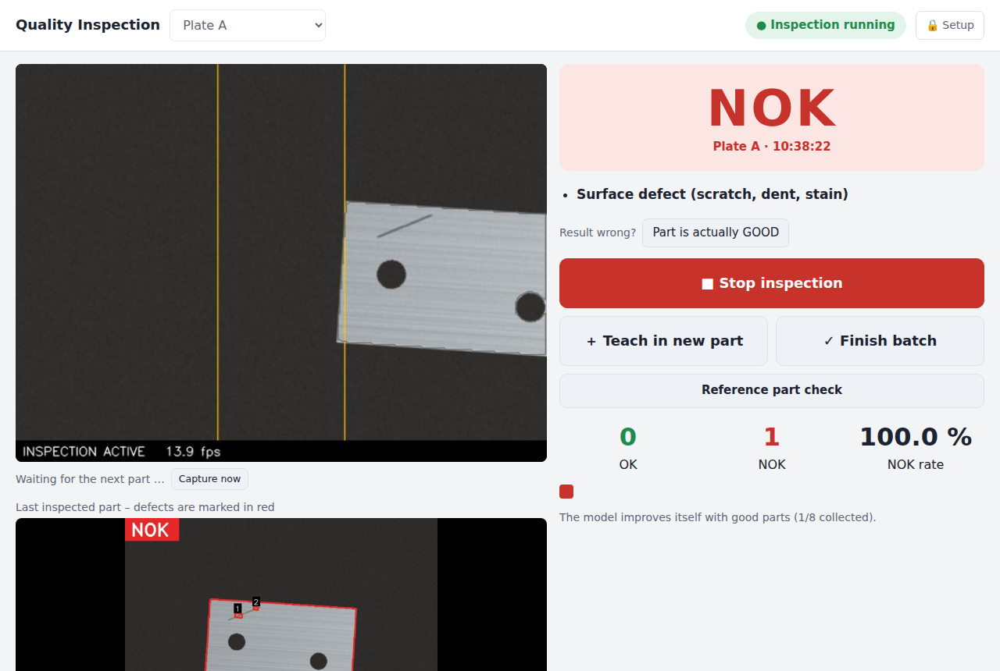
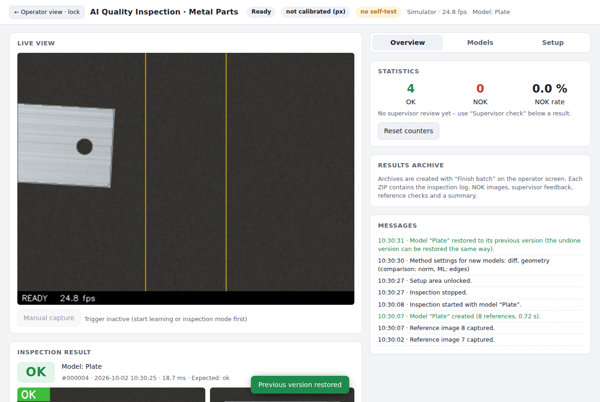

# Project 1 – AI-assisted quality inspection of metal parts

Camera-based OK/NOK inspection of metal parts on a conveyor belt, running on a Raspberry Pi.
The system is taught per part type with 10–20 **good parts**. It needs no defect examples and no
predefined defect categories. It inspects with a combination of classical image processing (OpenCV),
reference image comparison and unsupervised machine learning. For NOK parts, the defect location is
marked in the image.



## Two levels of operation

| | Who | What |
|---|---|---|
| **Operator screen** (default, no PIN) | Supervisor at the conveyor | Select part · Start/Stop · big OK/NOK with the defect in plain words · *Teach in new part* (2-step assistant) · *Finish batch* (ZIP + reset) · *Reference part check* · “Result wrong?” button |
| **Setup area** (🔒 Setup, PIN) | Setup technician | Live scores and history, methods, sensitivity, model management incl. *Undo last update*, calibration, lighting mode, focus assistant, GPIO, drift values, archives, log messages, simulator |

The PIN is set in `config.json → "ui": {"setup_pin": "1234"}` – **change it**. `""` = no PIN. The PIN is checked
on the server (not only hidden in the page); after 5 wrong entries input is blocked for 60 s, and the setup area
locks itself after 30 min without activity (`setup_timeout_min`) or with *← Operator view · lock*.

What the supervisor does **not** need to do any more:
- choose methods when teaching in (the defaults from `config.json` are used),
- click *Finish* when teaching in – the model is created automatically after `target_reference_count` parts,
- train collected good parts in – this runs automatically in the background (see *Self-learning*),
- read scores, thresholds or drift tables – the operator screen only shows plain hints such as
  “The image is getting blurry. Clean the camera lens and check the focus.”

## Quick start (no hardware)

```bash
python3 -m venv .venv && source .venv/bin/activate
pip install -r requirements.txt
python main.py web            # → http://localhost:8000
```

The simulator generates a conveyor with synthetic plates (simulator settings: setup area → Setup tab).
Workflow on the operator screen:

1. **＋ Teach in new part** → enter a name → *Next*. Run the good parts over the conveyor; each one is captured
   automatically in the middle of the picture (tap a thumbnail to remove a wrong capture). After 15 parts the
   model is created by itself (*Finish now* is possible from 3 parts).
2. **▶ Start inspection**. The result appears big (OK/NOK); for NOK the defect is named in plain words and marked
   in the picture of the last part. Wrong result? → *Part is actually GOOD / DEFECTIVE*.
3. **✓ Finish batch** at the end: all results are saved as a ZIP file, counters reset.

The setup area (PIN, default `1234`) shows the technical details next to the live view (scores of every method,
history) and has three tabs: **Overview** (statistics, archive downloads, messages), **Models** (method settings
for new models, sensitivity, retraining, self-learning, *Undo last update*) and **Setup** (lighting mode,
self-learning, camera & focus, calibration, drift monitor, GPIO outputs, simulator). Teaching in, start/stop,
reference check and finishing a batch are done on the operator screen only – one way for everything.



## Inspection pipeline

```
Camera image
  → Trigger: part completely visible and in the image centre?          (system.py)
  → Localisation: Otsu threshold, largest contour, minAreaRect         (alignment.py)
  → Alignment: centroid onto a fixed canvas, 360° rotation search against
    the reference (decided by the hole pattern), ECC fine alignment (sub-pixel)
  → Photometric normalisation: background = 0, part = 1
  → Image representation per method: gray, CLAHE, edges, threshold,
    LAB, HSV …                                                          (representations.py)
  → Inspection methods                                                   (methods.py)
       geometry  holes + outline vs. learned nominal geometry (sub-pixel)
       diff      z-score difference map vs. mean/spread image of the good parts
       pca       ML: PCA subspace of the good parts, reconstruction error = anomaly
  → Decision: fusion of the methods, × sensitivity per method           (model.py)
  → always 3 shots per part → majority vote (2nd/3rd only if the 1st is not clearly good)   (system.py)
  → OK / NOK + defect type + marking in the original image             (visualize.py)
  → log, lamps, delayed reject pulse, drift monitor                     (system.py, io_control.py, drift.py)
```

| Defect | Detected by | Reported as |
|---|---|---|
| missing hole | geometry | Hole missing |
| hole not drilled through | geometry (edge ring at the nominal location, but no see-through) | Hole not drilled through |
| mispositioned hole | geometry (Hungarian matching, tolerance from the learning phase) | Hole mispositioned |
| wrong diameter | geometry (equivalent diameter) | Wrong hole diameter |
| wrong shape (slot/cut-out) | geometry (aspect ratio) | Wrong cut-out shape |
| extra hole | geometry | Extra hole/cut-out |
| damaged outline | geometry (mask XOR) | Outline deviation |
| scratches, discoloration, anything unexpected | diff, pca | Deviation from reference image / ML anomaly |

**Thresholds without defect examples:** Geometry tolerances come from the spread of the good parts:
max(minimum tolerance, k·σ). For `diff` and `pca`, leave-one-out measures how far each good part deviates
from the others, and the threshold is set above that with a safety margin. After learning, the system
inspects its own references. It warns if one of them stands out, which usually means a defective part was
taught in by mistake.

## Improving detection – features

| Feature | Where | What it does |
|---|---|---|
| **Fusion decision** | `method.decision` | A method decides alone only above its stand-alone level (geometry/diff 1.0, ML 1.5); weaker findings need a second method to agree. Synthetic test: false alarms 0.75 % → 0 %, detection 94.5 % → 93.8 %. `"or"` restores the old behaviour. |
| **Sensitivity per method** | Models tab | Slider ×0.5 … ×2 per method and model (> 1 = stricter). Takes effect immediately, no retraining. |
| **Sub-pixel hole measurement** | automatic | Holes are cut at the exact 50 % level on a 4× upsampled patch. Measurement error for known shifts 0.03 px instead of 0.2 px. The fine alignment uses the part outline as datum, so a displaced hole cannot hide its own offset. |
| **Supervisor feedback** | result card | “Correct” / “Was OK – false alarm” / “Was NOK – missed defect”. Gives the real hit rate (statistics + archive summary). False alarms can be queued as extra references → *Retrain (+N feedback ref.)*. |
| **Multiple shots per part** | always on | 3 images while the part passes, majority vote → random false alarms (dust, reflections) disappear. Adaptive: if the 1st image is clearly good (every method below 50 % of its threshold) it is final; otherwise all 3 decide – a clearly good part costs one inspection, a doubtful one three. `inspection.shots_per_part` can be raised to 5, not below 3. |
| **Dual light** | Setup tab + `io` pins | Per part one backlight image (exact silhouette → holes/outline) and one front-light image (surface, blind holes). Separate model per light, results merged (“not drilled through” from front light replaces “missing” from backlight). |
| **Camera calibration** | Setup tab / `calibrate` | Checkerboard → mm/px, optional lens-distortion correction. Dimensions and tolerances in mm (`pos_tol_mm`, `dia_tol_mm`). Unreliable distortion estimates (board not tilted enough) are rejected automatically. |
| **Drift monitor** | Setup tab, header | Contrast, background, part size and edge sharpness vs. the learning phase; warning if lighting, camera distance or focus change. |
| **Self-test** | operator screen → *Reference part check* | Reference part check at shift start: known good part must be OK, known bad part NOK. Logged, shown in the header, included in the archive. |
| **GPIO outputs** | `io` in config.json | Reject pulse with travel-time delay (counted from the capture), OK/NOK lamps, light switching. Runs simulated without a Pi. |
| **Self-learning** | automatic (Setup tab to switch off) | Clear good parts are collected and trained in automatically every 30 parts, with safety checks (see below). |
| **Rotation search mode** | `localization.rotation_search` | `full` (any rotation), `flip` (0°/180°, mechanically guided parts), `off`. |
| **Benchmark** | `main.py benchmark` | Time per processing step on the target hardware. |

### Self-learning: the model improves with every batch

More good references make the statistical methods sharper (synthetic test: 10 → 30 references, detection
97.5 % → 100 %, ML threshold halved). But blindly adding every part rated OK is dangerous: in the same test,
**3 slightly defective parts among 60 references loosened the ML threshold five-fold and the detection of
small hole offsets dropped from 100 % to 80 %** – the model learns the defect as "normal", and slow process
drift (e.g. a blunt drill) would be learned away. Therefore:

1. **Collect only clear good parts** (automatic, Setup tab switch): every method must be below 50 % of its
   threshold, all shots OK, no drift warning active. Reservoir sampling keeps max. 100 parts per model, spread
   evenly over the whole production period.
2. **Train in automatically in the background** every `self_learning.auto_every` (30) collected parts. Inspection
   keeps running with the old model; collecting pauses meanwhile; the new model replaces the old one only when
   all checks pass. A rejected pool is discarded (it is not retried) and the operator screen shows a hint.
   `"auto": false` = only manually via the button in the Models tab (inspection stopped).
3. **Taught-in parts stay the anchor**: nominal dimensions, geometry tolerances, alignment reference and drift
   baseline are learned only from the taught-in (and supervisor-confirmed) references. Collected parts only
   refine the reference comparison and the ML method. Max. 80 references in total.
4. **Safety checks before the new model is used** – otherwise it is rejected and the old model stays active:
   * no statistical threshold may loosen by more than 30 % (more good parts normally make them tighter);
   * every *known defective part* that the current model detects must still be detected. Known defective parts
     are collected automatically from the self-test (bad part) and from supervisor feedback (“✓ Correct” on a NOK
     result, “Was NOK – missed defect”).
5. **Supervisor feedback “Part is actually DEFECTIVE”** on a collected part removes it from the pool (if that
   happens while the pool is being trained in, the update is cancelled). “Part is actually GOOD” on a false
   alarm queues the part as an additional reference; it becomes an anchor with the next (automatic) update.

Test: a clean pool of 45 parts was accepted (ML threshold −25 %, nominal geometry unchanged); a pool with 3
slightly defective parts was rejected by all three checks.

### Configuration example for the Pi (`config.json`)

```json
{
  "camera":      {"source": "pi", "exposure_us": 3000},
  "lighting":    {"mode": "dual", "idle_light": "front"},
  "inspection":  {"shots_per_part": 3},
  "io":          {"enabled": true, "reject_pin": 17, "reject_delay_ms": 600, "reject_pulse_ms": 150,
                  "ok_lamp_pin": 22, "nok_lamp_pin": 27, "front_light_pin": 23, "back_light_pin": 24},
  "method":      {"pos_tol_mm": 0.3, "dia_tol_mm": 0.15},
  "calibration": {"board_cols": 9, "board_rows": 6, "square_mm": 10.0},
  "self_learning": {"auto": true, "auto_every": 30},
  "ui":          {"setup_pin": "4711"}
}
```

GPIO numbers are BCM numbers. Drive valves, relays and LED strips via a driver board (MOSFET/relay module),
never directly from a pin. Measure `reject_delay_ms` on the real conveyor (camera → ejector travel time).

## Evaluation: which combination works?

```bash
python main.py evaluate --synthetic --md docs/evaluation_synthetic.md
python main.py evaluate --train images/good --test images/test    # own photos: test/ok, test/nok/<defect_type>
```

Results on synthetic data (15 training images, 40 good + 80 defective parts per scenario; full table in
[`docs/evaluation_synthetic.md`](docs/evaluation_synthetic.md)):

- **The combination `geometry + diff[norm] + pca[edges]`** detects all 8 defect types under front light
  with 0 % false alarms. Each single method covers only part of them: `geometry` misses surface defects,
  `diff[edges]` misses holes that are not drilled through, and the colour spaces (`lab_ab`, `hsv_s`) only find
  discoloration.
- **Photometric normalisation beats raw grayscale** (98 % vs. 82 %). It cancels brightness changes without
  losing sensitivity.
- **Backlight** gives very clean hole contours but makes surface defects invisible. It also cannot tell
  "not drilled through" apart from "missing": both are NOK, but reported as "missing".
  → Recommendation for the setup: **combine backlight and front light**, e.g. two captures or switchable
  lighting. This would be a good extension.
- **New shapes in any rotation** (triangle C, square D, parts arriving at 0–360°): the combination again
  detects all hole and outline defects with 0 % false alarms. Scratches on the triangle drop to 70 %, because
  the brushed texture rotates with the part (see "Surface texture" above).
- `pca[binary]` and `pca[norm]` cause false alarms in some scenarios (up to 30 %). ML is not a sure thing
  here; the preprocessing is decisive.

> **Important:** The synthetic defects are pronounced and self-modelled. The 100 % values only show that the
> pipeline works, not how well it performs on real parts. For reliable statements, repeat the evaluation
> with real photos (folder structure above), and include borderline defects in particular: small offsets,
> slightly wrong diameters, fine scratches.

## Teaching a new part type

The system does not assume any particular shape or number of holes. Outline, hole count, hole positions
and sizes are all learned from the good parts. A triangular plate with 3 holes, a square with 4 holes, an
L-bracket or a disc is taught in exactly like the rectangular plate: start learning mode, run 10–20 good
parts, finish. Each part type gets its own model, which you select before inspection.

The alignment searches the full 360° and decides between look-alike rotations (e.g. 0°/120°/240° for a
triangle) by the hole pattern. Parts can therefore arrive on the conveyor in any rotation.

What the part and the setup must satisfy:

| Requirement | Why |
|---|---|
| Clear contrast between the part and the belt (or backlight) | The part is found with an automatic threshold. Shiny metal on a matt dark belt, or backlight, works well. |
| Part completely in the image, same camera height as when learning | Everything is measured in pixels; a different distance changes all dimensions. |
| Flat part lying on the belt | The method is 2D. Tall parts, parts that can lie on different sides or tilted parts need their own model per resting position. |
| Holes are through holes, i.e. you can see the belt/backlight through them | Only then are they detected as holes. Blind holes are recognised by their edge (front light only). |
| 10–20 good parts, each placed slightly differently | The system learns the normal variation from them. Too few or identical placements make it over-sensitive. |
| Holes at least ~6 px in diameter in the image | Smaller holes are filtered as noise (`hole_min_area_px`). |

**Symmetric parts:** If the part *and* its hole pattern are fully symmetric (e.g. a square with 4 identical
holes in the corners), all matching rotations are equivalent and any of them is fine. If only the outline is
symmetric but the hole pattern is not, the hole pattern decides.

**Parts lying upside down:** A flat part turned over is a mirror image. By default it is rated NOK, because
the mirrored part may be a different part (left/right version). Set `"localization": {"allow_mirror": true}` in
`config.json` if a turned-over part is still a good part.

**Warnings after learning:** The UI warns if a reference image looks like a defective part, if the hole count
differs between references, or if hole positions scatter strongly between references. In the last case the
model would be insensitive to position errors. Check lighting and contrast, then teach in again.

**Surface texture:** Brushed or grinding textures rotate with the part. If parts arrive in random rotations,
the learned texture variation is higher and fine scratches are detected less reliably than with aligned
parts. Hole and outline defects are not affected.

## Running on the Raspberry Pi

**Recommended hardware:** Raspberry Pi 5 (or a Pi 4 with 4 GB). With a moving conveyor, use a
**global-shutter camera**, because a rolling shutter distorts moving parts. Otherwise use a Camera Module 3 or
HQ Camera with a short exposure time. Mount the camera perpendicular above the belt at a fixed distance and
shield it from ambient light.

**Installation (once)** – Raspberry Pi OS (Bookworm or newer), project unzipped e.g. to `~/pi_qc`:

```bash
cd ~/pi_qc
bash deploy/install.sh
```

The script installs the system packages (picamera2, OpenCV, Flask, waitress), creates the Python environment
`.venv`, creates `config.json` from the Raspberry Pi 3 + Camera Module v2 preset, asks for the setup PIN and
installs the autostart service `qc`. From then on the inspection **starts by itself at every boot** and is
restarted automatically if it ever stops. Open the UI on a laptop/tablet/phone: `http://<IP of the Pi>:8000`.

| Task | Command |
|---|---|
| Restart after a configuration change | `sudo systemctl restart qc` |
| Live log / errors | `journalctl -u qc -f` or `data/logs/qc.log` |
| Stop autostart | `sudo systemctl disable --now qc` |
| Start by hand (e.g. for testing) | `.venv/bin/python main.py web --camera pi` (stop the service first) |
| Camera test | `rpicam-hello -t 5000` (service stopped – only one program can use the camera) |

Then teach in a part on the operator screen (*＋ Teach in new part*): the automatic camera setup sets exposure,
white balance, zoom and belt direction. Only the lens of a camera without focus motor has to be focused once by
hand (setup area → *Setup* → *Camera & focus* → focus assistant).

Other camera sources: `--camera usb:0`, or `--camera folder:/path/to/photos` to inspect an image folder one image
at a time.

**Camera settings** (`config.json → camera`): fixed exposure (`exposure_us`), fixed gain and fixed white
balance are preset on purpose. Automatic settings would change the brightness from part to part and
disturb the reference comparisons.

**Focus (Camera Module 3 / autofocus cameras):** With `"lens_position": null` (default) the camera runs
one autofocus cycle at start-up and then locks the focus. For reproducible results set a fixed value in
dioptres, e.g. `"lens_position": 3.3` (≈ 30 cm working distance; value = 100 / distance in cm). The focus
used is written to the log at start-up. Cameras without autofocus (Camera Module v2, HQ, Global Shutter)
ignore the setting; focus them by hand with the **focus assistant** (setup area → Setup → *Camera & focus*).

**Run time:** On an x86 laptop an inspection takes about 20 ms (including the 360° rotation search), and
training takes about 1 s (15 images). On the Pi run `main.py benchmark`. Measured on a **Raspberry Pi 3 Model B**
before the speed-up below: 411 ms per part (alignment 285 ms), training 20 s; with the speed-up roughly
40 % less is expected. The 360° rotation search compares the part with 360 pre-rotated reference images in one
matrix product, the reference preparation is cached per model, and intermediate alignment steps render only the
grey image – results are identical (checked: alignment scatter 0.01–0.017 px, all tests unchanged).

### Raspberry Pi 3 Model B + Camera Module v2 (IMX219)

Start with the ready-made preset: `.venv/bin/python main.py --config config.pi3_imx219.json web --camera pi`
(copy it to `config.json` and adjust it there later).

| Setting | Value | Why |
|---|---|---|
| `camera.sensor_mode` | `[1640, 1232]` | 2×2-binned readout of the **full** sensor: full field of view, less noise. Without it libcamera may pick 1920×1080, which on the IMX219 is a **crop** of the image centre. The log shows the readout mode at start-up and warns about a crop. |
| `camera.width/height` | 640 × 480 | The camera's ISP scales to the working resolution for free – the Pi 3 no longer has to shrink every 1280×960 frame (that alone took ~40 ms per part). |
| `camera.fps` | 15 | Fewer frames to copy and check on the 1 GB / 1.2 GHz Pi 3. |
| `camera.exposure_us` | 2000 | Short against motion blur: blur = belt speed × exposure (50 mm/s × 2 ms = 0.1 mm). Needs bright, constant light. |
| `trigger.detect_width` | 240 | Part detection for the trigger on a smaller image. |
| `self_learning.max_references` | 40 | Less RAM and shorter background training on the Pi 3. |
| `ui.preview_fps` | 5 | The live image costs CPU on the Pi and in the browser. |

Independent of the preset, the software now:
- corrects lens distortion only for the frames that are inspected, not for every camera frame;
- always takes a **fresh** frame (no frame that waited in a buffer while the Pi was busy) and times the reject
  pulse from the sensor timestamp, so a slow inspection does not shift the ejector timing.

Hardware notes for this combination:
- **Focus:** the Camera Module v2 lens is set to far distance at the factory. At 20–40 cm the image is blurry
  until you turn the lens (counter-clockwise = closer) with the small plastic tool. Use the focus assistant.
- **Rolling shutter:** the IMX219 reads the image line by line in about 24 ms (1640×1232 mode). A moving part is
  sheared by up to belt speed × 24 ms × (part height / image height). Taught-in and inspected parts at the same
  constant speed are sheared alike, but for the best measuring accuracy stop the part under the camera or run
  the belt slowly.
- **Run the browser on another device** (laptop, tablet, phone): Firefox on the Pi 3 itself takes a large share
  of the CPU and the 1 GB RAM. If a monitor at the Pi is needed, keep `preview_fps` low.
- **Power supply 5.1 V / 2.5 A** and a heat sink: under-voltage (lightning icon) or overheating throttles the CPU.
- **Guided parts:** if the parts always arrive in the same orientation (or turned by 180°), you can set
  `"localization": {"rotation_search": "flip"}`; since the speed-up the 360° search costs only a few ms.

## Automatic camera setup

When a new part type is taught in, the camera adjusts itself – no camera knowledge is needed at the conveyor.
The operator only lays one good part under the camera and lets the parts run:

| Step | What the software does | What stays manual |
|---|---|---|
| 1 · One good part lies still under the camera → *Adjust camera automatically* | White balance once and locked. Exposure: the brightest pixels of part + surroundings are set to ≈ 225 of 255 (bright, nothing clipped), gain 1.0 for the least noise. Autofocus on the part and lock (cameras with a focus motor, e.g. Camera Module 3). Sharpness check (edge width) for cameras without one. Size and position of the part. | — |
| 2 · Start the belt; the **first part** runs through (not counted) | Belt direction (x/y) and the line the parts travel on. Belt speed → exposure shortened so that motion blur stays ≤ 0.5 px (gain raised to keep the brightness). **Digital zoom**: the sensor is read only around the part's path (2.0 × part size along the belt, 1.6 × across, square pixels, max. 2.5×) – the part covers up to 2.5× more pixels, every measurement gets finer. | — |
| 3 · The other good parts run | Teach-in as usual; sharpness of every reference is measured. | — |
| Afterwards | All settings are stored **with the model** and applied automatically whenever this part type is selected. | Lens of a camera **without** focus motor (Camera Module v2, HQ): focus once by hand with the focus assistant – the setup reports a blurry image. Camera mount and lighting. |

Notes:
- **No checkerboard calibration needed** for OK/NOK: tolerances are learned from the good parts, and the trigger
  always captures the parts at the same place in the image, so lens distortion affects references and inspected
  parts alike. Calibrate only if you want results in millimetres; the zoom is taken into account automatically
  (calibrate once at the full field of view).
- Too little light for the belt speed, low contrast between part and belt, a part that almost fills the image or a
  blurry lens are reported in plain words during the setup.
- Settings: `config.json → "autosetup"` (`max_blur_px`, `max_zoom`, `margin_along`, `margin_across`, `max_gain`,
  `edge_width_max_px`, `enabled`). Without a controllable camera (USB camera, image folder) the step is skipped.
- Simulator: `"camera": {"sim_part_scale": 0.5, "exposure_us": 9000}` simulates a higher-mounted camera and a badly
  set exposure; `"sim_defocus": 2.5` a blurry lens, `"sim_autofocus": true` a camera with focus motor.

**Security:** The web UI has no login by default. Only run it on an isolated network, or set `QC_TOKEN`.
All modifying actions then require the token; open the page with `?token=…`. Model names are checked
against path traversal.

## Command line

```bash
python main.py train   --name PlateA --images photos/good/ [--methods geometry,diff --diff-rep clahe]
python main.py inspect --model PlateA photos/new/*.png --out results/
python main.py generate --out data/synth --lighting back --part-type B
python main.py board --out board.pdf --cols 9 --rows 6 --square 10      # printable checkerboard (A4, 100 %)
python main.py calibrate --images calib/ --cols 9 --rows 6 --square 10   # 1st image: board flat on the belt
python main.py benchmark                   # time per step – run this on the Pi
python -m pytest -q                        # 46 tests, incl. complete web workflows with the simulator
```

## Data storage

```
data/models/<name>/     recipe.json (channels, sensitivity)
                        channels/<main|back|front>/  meta.json, arrays.npz,
                            refs/ (taught-in anchors), learned/ (self-learned), collected/ (pool),
                            pending/ (feedback), known_bad/ (safety check)
data/results/<date>/    inspection_log.csv, feedback_log.csv, selftest_log.csv, NOK images (marked + original)
data/archive/*.zip      archived batches
data/calibration.json   camera calibration
```

### Archiving a finished batch

When a batch or part type is finished, **stop the inspection** and click **Archive & clear results** in the
*Results archive* card. Optionally enter a batch name first; the default is the model name. The system then:

1. packs the complete results folder into `data/archive/<batch-name>_<date>_<time>.zip`, together with
   `summary.txt` / `summary.json` (parts inspected, OK/NOK, NOK rate, count per defect type, model, time range),
2. verifies the ZIP and only then empties the results folder,
3. resets counters and history, ready for the next part type.

Archives are listed in the UI with their key figures and can be downloaded or deleted there. The same from the
command line: `python main.py archive --name "Plate A batch 1"` (or `--list`).

The reference images are stored inside the model, so a model can be **retrained** at any time with different
methods or image representations (button in the UI). This is handy for comparisons.

## Project structure

```
main.py                  command line (web, train, inspect, archive, board, calibrate, benchmark, generate, evaluate)
qc/config.py             all parameters (dataclasses, overridable via config.json)
qc/camera.py             Pi camera, USB, image folder, simulator
qc/alignment.py          localisation, alignment, photometric normalisation
qc/representations.py    image representations (gray, CLAHE, edges, threshold, LAB, HSV …)
qc/methods.py            inspection methods geometry / diff / pca
qc/model.py              one channel: learning, inspection, fusion decision, drift measurements
qc/recipe.py             part type = 1 or 2 channels (single/dual light), sensitivity, feedback refs, retraining
qc/visualize.py          defect location marking, heatmap
qc/system.py             core: camera thread → inspection queue → worker thread, teach-in, inspection, archive
qc/system_camera.py      camera profiles, automatic camera setup, focus assistant, calibration session
qc/system_models.py      model management, undo, self-learning, supervisor feedback, reference part check
qc/system_status.py      status for the UI, plain-language notices for the supervisor
qc/trigger.py            conveyor trigger (one capture per part)
qc/autosetup.py          calculations of the automatic camera setup (exposure, zoom, sharpness, belt path)
qc/calibration.py        checkerboard calibration, undistortion, mm/px
qc/drift.py              image-quality drift monitor
qc/io_control.py         GPIO: reject, lamps, lighting (simulated without a Pi)
qc/webapp.py             web server API (Flask; served by waitress when installed), setup PIN
qc/static/               index.html, app.css, common.js, setup.js (setup area), operator.js (operator screen)
deploy/install.sh        one-time installation on the Pi incl. autostart service
qc/synthetic.py          synthetic parts with defects
qc/evaluate.py           comparison of method × representation × lighting
qc/archive.py            zip + summary of finished batches, clear results
tests/                   pytest (51 tests, incl. a stand-in for picamera2 to test the Pi camera code)
```

## Robustness

| Feature | What it does |
|---|---|
| Inspection queue | The camera thread only captures; a worker thread inspects. The live view and the trigger keep running while the Pi 3 inspects. If more than 3 parts wait, the next part is **rejected without inspection** (fail-safe) and the operator screen says so. |
| Log file | `data/logs/qc.log` (3 × 1 MB rotating) – also errors from the background threads. |
| Configuration check | Typos (`"exposure"` instead of `"exposure_us"`) and invalid values stop the start with a clear message instead of being silently ignored. |
| Saved settings | Settings changed in the setup area (lighting mode, self-learning, methods for new models) are kept in `data/settings.json` and survive a restart; `config.json` is never rewritten. |
| Undo last update | Before a model is replaced (teach-in with the same name, retraining, self-learning) the previous version is kept; *Models → Undo last update* swaps them back. |
| Autostart | systemd service with automatic restart (`deploy/install.sh`). |
| Production web server | waitress instead of Flask's development server (falls back to Flask if waitress is missing). |

## Open points / extensions

- **Real images**: fine-tune the thresholds (`method` section of the configuration) on real parts.
- **Hardware partly tested**: the Pi camera runs on a Raspberry Pi 3 + Camera Module v2; the automatic camera
  setup (crop, white balance) and the GPIO outputs are tested against simulations only. Check the timing of the
  light switching (`lighting.settle_frames`) on the real camera.
- **Stronger ML**: pretrained features (e.g. MobileNet via TFLite) plus PatchCore-style nearest-neighbour
  comparison could be added as another method in `methods.py`.
- **PLC connection** instead of/in addition to GPIO (e.g. Modbus TCP): hook in `QCSystem._inspect`.
